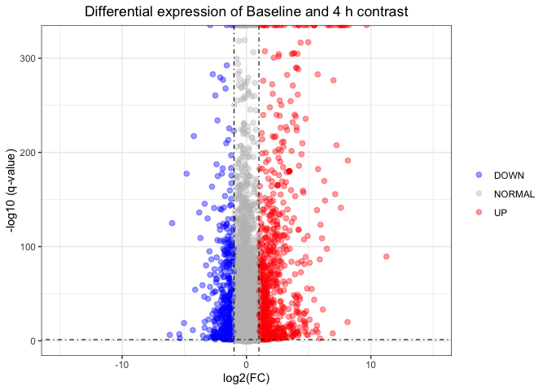

In this Markdown, we are going to make a DEGs analysis of the **GSE227221** series. This data, contains the gene expression profiling RNA-seq data of *iPS-derived microglia-like cells treated with pre-formed amyloid beta 1-42 fibrils* at four different timepoints. This will allow us to study human microglial inflammatory progression in Alzheimer's disease.


# Import necessary libraries


```r
if (!requireNamespace("BiocManager", quietly = TRUE))
  install.packages("BiocManager")

BiocManager::install("tximport")
BiocManager::install("biomaRt")
BiocManager::install("DESeq2")
BiocManager::install("BiocParallel")
install.packages("gplots")
install.packages('DT')
install.packages('formattable')
BiocManager::install('clusterProfiler')
BiocManager::install('org.Hs.eg.db')
BiocManager::install('enrichplot')
```


```r
library(biomaRt)
library(tximport)
library(DESeq2)
library(BiocParallel)
library(ggplot2)
library(pheatmap)
library(RColorBrewer)
library(gplots)
library(DT)
library(formattable)
library(clusterProfiler)
library(org.Hs.eg.db)
library(enrichplot)
```

# Directories set-up


```r
workingDir <- '/Volumes/TOSHIBA/4t/PVDO/Project/'
dataDir <- file.path(workingDir, 'data/kallisto_out/')
resultsDir <- file.path(workingDir, 'results/')
setwd(workingDir)
```

# Annotation

In order to later make the annotation of our results, we are going to save in the data frame `table` the listed attributes in the code, of the *Homo Sapiens* gene ENSEMBL database.

```r
working_attributes <- c('ensembl_transcript_id', 'ensembl_gene_id', 
                        'external_gene_name', 'gene_biotype', 'description')
ensembl <- useEnsembl(biomart = "genes", dataset = "hsapiens_gene_ensembl", version = 96)
table <- getBM(attributes = working_attributes, mart = ensembl)
dim(table)
```

```
## [1] 229428      5
```

```r
datatable(head(table, 50))
```

```{=html}
<div class="datatables html-widget html-fill-item-overflow-hidden html-fill-item" id="htmlwidget-26946b57f5c385ab63b8" style="width:100%;height:auto;"></div>
<script type="application/json" data-for="htmlwidget-26946b57f5c385ab63b8">{"x":{"filter":"none","vertical":false,"data":[["1","2","3","4","5","6","7","8","9","10","11","12","13","14","15","16","17","18","19","20","21","22","23","24","25","26","27","28","29","30","31","32","33","34","35","36","37","38","39","40","41","42","43","44","45","46","47","48","49","50"],["ENST00000387314","ENST00000389680","ENST00000387342","ENST00000387347","ENST00000386347","ENST00000361390","ENST00000387365","ENST00000387372","ENST00000387377","ENST00000361453","ENST00000387382","ENST00000387392","ENST00000387400","ENST00000387405","ENST00000387409","ENST00000361624","ENST00000387416","ENST00000387419","ENST00000361739","ENST00000387421","ENST00000361851","ENST00000361899","ENST00000362079","ENST00000387429","ENST00000361227","ENST00000387439","ENST00000361335","ENST00000361381","ENST00000387441","ENST00000387449","ENST00000387456","ENST00000361567","ENST00000361681","ENST00000387459","ENST00000361789","ENST00000387460","ENST00000387461","ENST00000573479","ENST00000391076","ENST00000362684","ENST00000496478","ENST00000516106","ENST00000613842","ENST00000362660","ENST00000384467","ENST00000459215","ENST00000465665","ENST00000364486","ENST00000459326","ENST00000516838"],["ENSG00000210049","ENSG00000211459","ENSG00000210077","ENSG00000210082","ENSG00000209082","ENSG00000198888","ENSG00000210100","ENSG00000210107","ENSG00000210112","ENSG00000198763","ENSG00000210117","ENSG00000210127","ENSG00000210135","ENSG00000210140","ENSG00000210144","ENSG00000198804","ENSG00000210151","ENSG00000210154","ENSG00000198712","ENSG00000210156","ENSG00000228253","ENSG00000198899","ENSG00000198938","ENSG00000210164","ENSG00000198840","ENSG00000210174","ENSG00000212907","ENSG00000198886","ENSG00000210176","ENSG00000210184","ENSG00000210191","ENSG00000198786","ENSG00000198695","ENSG00000210194","ENSG00000198727","ENSG00000210195","ENSG00000210196","ENSG00000262477","ENSG00000212378","ENSG00000277234","ENSG00000243313","ENSG00000251915","ENSG00000276988","ENSG00000199530","ENSG00000207196","ENSG00000239102","ENSG00000243959","ENSG00000201356","ENSG00000239149","ENSG00000252647"],["MT-TF","MT-RNR1","MT-TV","MT-RNR2","MT-TL1","MT-ND1","MT-TI","MT-TQ","MT-TM","MT-ND2","MT-TW","MT-TA","MT-TN","MT-TC","MT-TY","MT-CO1","MT-TS1","MT-TD","MT-CO2","MT-TK","MT-ATP8","MT-ATP6","MT-CO3","MT-TG","MT-ND3","MT-TR","MT-ND4L","MT-ND4","MT-TH","MT-TS2","MT-TL2","MT-ND5","MT-ND6","MT-TE","MT-CYB","MT-TT","MT-TP","AC021224.1","RF00592","RNU1-5P","RN7SL285P","RNA5SP406","RF00017","RF00019","RF00019","RNU7-185P","RN7SL684P","RNA5SP500","SNORA59A","RNA5SP416"],["Mt_tRNA","Mt_rRNA","Mt_tRNA","Mt_rRNA","Mt_tRNA","protein_coding","Mt_tRNA","Mt_tRNA","Mt_tRNA","protein_coding","Mt_tRNA","Mt_tRNA","Mt_tRNA","Mt_tRNA","Mt_tRNA","protein_coding","Mt_tRNA","Mt_tRNA","protein_coding","Mt_tRNA","protein_coding","protein_coding","protein_coding","Mt_tRNA","protein_coding","Mt_tRNA","protein_coding","protein_coding","Mt_tRNA","Mt_tRNA","Mt_tRNA","protein_coding","protein_coding","Mt_tRNA","protein_coding","Mt_tRNA","Mt_tRNA","lincRNA","snoRNA","snRNA","misc_RNA","rRNA_pseudogene","misc_RNA","misc_RNA","misc_RNA","snRNA","misc_RNA","rRNA_pseudogene","snoRNA","rRNA_pseudogene"],["mitochondrially encoded tRNA-Phe (UUU/C) [Source:HGNC Symbol;Acc:HGNC:7481]","mitochondrially encoded 12S RNA [Source:HGNC Symbol;Acc:HGNC:7470]","mitochondrially encoded tRNA-Val (GUN) [Source:HGNC Symbol;Acc:HGNC:7500]","mitochondrially encoded 16S RNA [Source:HGNC Symbol;Acc:HGNC:7471]","mitochondrially encoded tRNA-Leu (UUA/G) 1 [Source:HGNC Symbol;Acc:HGNC:7490]","mitochondrially encoded NADH:ubiquinone oxidoreductase core subunit 1 [Source:HGNC Symbol;Acc:HGNC:7455]","mitochondrially encoded tRNA-Ile (AUU/C) [Source:HGNC Symbol;Acc:HGNC:7488]","mitochondrially encoded tRNA-Gln (CAA/G) [Source:HGNC Symbol;Acc:HGNC:7495]","mitochondrially encoded tRNA-Met (AUA/G) [Source:HGNC Symbol;Acc:HGNC:7492]","mitochondrially encoded NADH:ubiquinone oxidoreductase core subunit 2 [Source:HGNC Symbol;Acc:HGNC:7456]","mitochondrially encoded tRNA-Trp (UGA/G) [Source:HGNC Symbol;Acc:HGNC:7501]","mitochondrially encoded tRNA-Ala (GCN) [Source:HGNC Symbol;Acc:HGNC:7475]","mitochondrially encoded tRNA-Asn (AAU/C) [Source:HGNC Symbol;Acc:HGNC:7493]","mitochondrially encoded tRNA-Cys (UGU/C) [Source:HGNC Symbol;Acc:HGNC:7477]","mitochondrially encoded tRNA-Tyr (UAU/C) [Source:HGNC Symbol;Acc:HGNC:7502]","mitochondrially encoded cytochrome c oxidase I [Source:HGNC Symbol;Acc:HGNC:7419]","mitochondrially encoded tRNA-Ser (UCN) 1 [Source:HGNC Symbol;Acc:HGNC:7497]","mitochondrially encoded tRNA-Asp (GAU/C) [Source:HGNC Symbol;Acc:HGNC:7478]","mitochondrially encoded cytochrome c oxidase II [Source:HGNC Symbol;Acc:HGNC:7421]","mitochondrially encoded tRNA-Lys (AAA/G) [Source:HGNC Symbol;Acc:HGNC:7489]","mitochondrially encoded ATP synthase membrane subunit 8 [Source:HGNC Symbol;Acc:HGNC:7415]","mitochondrially encoded ATP synthase membrane subunit 6 [Source:HGNC Symbol;Acc:HGNC:7414]","mitochondrially encoded cytochrome c oxidase III [Source:HGNC Symbol;Acc:HGNC:7422]","mitochondrially encoded tRNA-Gly (GGN) [Source:HGNC Symbol;Acc:HGNC:7486]","mitochondrially encoded NADH:ubiquinone oxidoreductase core subunit 3 [Source:HGNC Symbol;Acc:HGNC:7458]","mitochondrially encoded tRNA-Arg (CGN) [Source:HGNC Symbol;Acc:HGNC:7496]","mitochondrially encoded NADH:ubiquinone oxidoreductase core subunit 4L [Source:HGNC Symbol;Acc:HGNC:7460]","mitochondrially encoded NADH:ubiquinone oxidoreductase core subunit 4 [Source:HGNC Symbol;Acc:HGNC:7459]","mitochondrially encoded tRNA-His (CAU/C) [Source:HGNC Symbol;Acc:HGNC:7487]","mitochondrially encoded tRNA-Ser (AGU/C) 2 [Source:HGNC Symbol;Acc:HGNC:7498]","mitochondrially encoded tRNA-Leu (CUN) 2 [Source:HGNC Symbol;Acc:HGNC:7491]","mitochondrially encoded NADH:ubiquinone oxidoreductase core subunit 5 [Source:HGNC Symbol;Acc:HGNC:7461]","mitochondrially encoded NADH:ubiquinone oxidoreductase core subunit 6 [Source:HGNC Symbol;Acc:HGNC:7462]","mitochondrially encoded tRNA-Glu (GAA/G) [Source:HGNC Symbol;Acc:HGNC:7479]","mitochondrially encoded cytochrome b [Source:HGNC Symbol;Acc:HGNC:7427]","mitochondrially encoded tRNA-Thr (ACN) [Source:HGNC Symbol;Acc:HGNC:7499]","mitochondrially encoded tRNA-Pro (CCN) [Source:HGNC Symbol;Acc:HGNC:7494]","","","RNA, U1 small nuclear 5, pseudogene [Source:HGNC Symbol;Acc:HGNC:48304]","RNA, 7SL, cytoplasmic 285, pseudogene [Source:HGNC Symbol;Acc:HGNC:46301]","RNA, 5S ribosomal pseudogene 406 [Source:HGNC Symbol;Acc:HGNC:43306]","","","","RNA, U7 small nuclear 185 pseudogene [Source:HGNC Symbol;Acc:HGNC:45719]","RNA, 7SL, cytoplasmic 684, pseudogene [Source:HGNC Symbol;Acc:HGNC:46700]","RNA, 5S ribosomal pseudogene 500 [Source:HGNC Symbol;Acc:HGNC:43400]","small nucleolar RNA, H/ACA box 59A [Source:HGNC Symbol;Acc:HGNC:32653]","RNA, 5S ribosomal pseudogene 416 [Source:HGNC Symbol;Acc:HGNC:43316]"]],"container":"<table class=\"display\">\n  <thead>\n    <tr>\n      <th> <\/th>\n      <th>ensembl_transcript_id<\/th>\n      <th>ensembl_gene_id<\/th>\n      <th>external_gene_name<\/th>\n      <th>gene_biotype<\/th>\n      <th>description<\/th>\n    <\/tr>\n  <\/thead>\n<\/table>","options":{"columnDefs":[{"orderable":false,"targets":0}],"order":[],"autoWidth":false,"orderClasses":false},"selection":{"mode":"multiple","selected":null,"target":"row","selectable":null}},"evals":[],"jsHooks":[]}</script>
```

# Kallisto abundance files

Now, we are going to read the abundance files already processed using Kallisto, and save them on the `txi` object.

```r
dirnames <- list.dirs(dataDir, full.names = TRUE, recursive=FALSE)
files <- file.path(dirnames, 'abundance.h5')
print(files)
```

```
##  [1] "/Volumes/TOSHIBA/4t/PVDO/Project//data/kallisto_out//SRR23839035/abundance.h5"
##  [2] "/Volumes/TOSHIBA/4t/PVDO/Project//data/kallisto_out//SRR23839036/abundance.h5"
##  [3] "/Volumes/TOSHIBA/4t/PVDO/Project//data/kallisto_out//SRR23839037/abundance.h5"
##  [4] "/Volumes/TOSHIBA/4t/PVDO/Project//data/kallisto_out//SRR23839038/abundance.h5"
##  [5] "/Volumes/TOSHIBA/4t/PVDO/Project//data/kallisto_out//SRR23839039/abundance.h5"
##  [6] "/Volumes/TOSHIBA/4t/PVDO/Project//data/kallisto_out//SRR23839040/abundance.h5"
##  [7] "/Volumes/TOSHIBA/4t/PVDO/Project//data/kallisto_out//SRR23839041/abundance.h5"
##  [8] "/Volumes/TOSHIBA/4t/PVDO/Project//data/kallisto_out//SRR23839042/abundance.h5"
##  [9] "/Volumes/TOSHIBA/4t/PVDO/Project//data/kallisto_out//SRR23839043/abundance.h5"
## [10] "/Volumes/TOSHIBA/4t/PVDO/Project//data/kallisto_out//SRR23839044/abundance.h5"
## [11] "/Volumes/TOSHIBA/4t/PVDO/Project//data/kallisto_out//SRR23839045/abundance.h5"
## [12] "/Volumes/TOSHIBA/4t/PVDO/Project//data/kallisto_out//SRR23839046/abundance.h5"
```

```r
txi <- tximport(files, type = "kallisto", tx2gene = table, ignoreTxVersion=TRUE) 
```

```
## 1 2 3 4 5 6 7 8 9 10 11 12 
## transcripts missing from tx2gene: 171
## summarizing abundance
## summarizing counts
## summarizing length
## summarizing inferential replicates
```

# Metadata table

To do de DEGs analysis we first need to set the experimental design of our data on the `metadata` table. We are going to indicate the replicates of our samples and the time of treatment each one has been submitted to.

```r
metadata <- data.frame(
  rep = factor(c(rep(c("C", "B", "A"), 4))),
  time = factor(c(rep("96h", 3), rep("24h", 3), rep("4h", 3), rep("baseline", 3)))
)

formattable(metadata, align = "c", list(
  rep = color_tile("transparent", "darkseagreen1"),
  time = color_tile("gold", "deeppink")
))
```


<table class="table table-condensed">
 <thead>
  <tr>
   <th style="text-align:center;"> rep </th>
   <th style="text-align:center;"> time </th>
  </tr>
 </thead>
<tbody>
  <tr>
   <td style="text-align:center;"> <span style="display: block; padding: 0 4px; border-radius: 4px; background-color: #c1ffc1">C</span> </td>
   <td style="text-align:center;"> <span style="display: block; padding: 0 4px; border-radius: 4px; background-color: #ff5562">96h     </span> </td>
  </tr>
  <tr>
   <td style="text-align:center;"> <span style="display: block; padding: 0 4px; border-radius: 4px; background-color: #e0ffe0">B</span> </td>
   <td style="text-align:center;"> <span style="display: block; padding: 0 4px; border-radius: 4px; background-color: #ff5562">96h     </span> </td>
  </tr>
  <tr>
   <td style="text-align:center;"> <span style="display: block; padding: 0 4px; border-radius: 4px; background-color: #ffffff">A</span> </td>
   <td style="text-align:center;"> <span style="display: block; padding: 0 4px; border-radius: 4px; background-color: #ff5562">96h     </span> </td>
  </tr>
  <tr>
   <td style="text-align:center;"> <span style="display: block; padding: 0 4px; border-radius: 4px; background-color: #c1ffc1">C</span> </td>
   <td style="text-align:center;"> <span style="display: block; padding: 0 4px; border-radius: 4px; background-color: #ffd700">24h     </span> </td>
  </tr>
  <tr>
   <td style="text-align:center;"> <span style="display: block; padding: 0 4px; border-radius: 4px; background-color: #e0ffe0">B</span> </td>
   <td style="text-align:center;"> <span style="display: block; padding: 0 4px; border-radius: 4px; background-color: #ffd700">24h     </span> </td>
  </tr>
  <tr>
   <td style="text-align:center;"> <span style="display: block; padding: 0 4px; border-radius: 4px; background-color: #ffffff">A</span> </td>
   <td style="text-align:center;"> <span style="display: block; padding: 0 4px; border-radius: 4px; background-color: #ffd700">24h     </span> </td>
  </tr>
  <tr>
   <td style="text-align:center;"> <span style="display: block; padding: 0 4px; border-radius: 4px; background-color: #c1ffc1">C</span> </td>
   <td style="text-align:center;"> <span style="display: block; padding: 0 4px; border-radius: 4px; background-color: #ff9631">4h      </span> </td>
  </tr>
  <tr>
   <td style="text-align:center;"> <span style="display: block; padding: 0 4px; border-radius: 4px; background-color: #e0ffe0">B</span> </td>
   <td style="text-align:center;"> <span style="display: block; padding: 0 4px; border-radius: 4px; background-color: #ff9631">4h      </span> </td>
  </tr>
  <tr>
   <td style="text-align:center;"> <span style="display: block; padding: 0 4px; border-radius: 4px; background-color: #ffffff">A</span> </td>
   <td style="text-align:center;"> <span style="display: block; padding: 0 4px; border-radius: 4px; background-color: #ff9631">4h      </span> </td>
  </tr>
  <tr>
   <td style="text-align:center;"> <span style="display: block; padding: 0 4px; border-radius: 4px; background-color: #c1ffc1">C</span> </td>
   <td style="text-align:center;"> <span style="display: block; padding: 0 4px; border-radius: 4px; background-color: #ff1493">baseline</span> </td>
  </tr>
  <tr>
   <td style="text-align:center;"> <span style="display: block; padding: 0 4px; border-radius: 4px; background-color: #e0ffe0">B</span> </td>
   <td style="text-align:center;"> <span style="display: block; padding: 0 4px; border-radius: 4px; background-color: #ff1493">baseline</span> </td>
  </tr>
  <tr>
   <td style="text-align:center;"> <span style="display: block; padding: 0 4px; border-radius: 4px; background-color: #ffffff">A</span> </td>
   <td style="text-align:center;"> <span style="display: block; padding: 0 4px; border-radius: 4px; background-color: #ff1493">baseline</span> </td>
  </tr>
</tbody>
</table>

# DEGs analysis

## DESeq2

With our data ready, we are going to follow the DESeq2 pipeline to finally make the analysis. For that, we are going to construct a DESeqDataSet from the `txi` object and the sample information `samples`. Our design will be `~ time` as it is our variable of interest.
Next, with the created object, we are going to re-level the factor of `time` and set the baseline as reference, as we want to make contrasts of baseline against all other treatment times. Then, we are going to filter out low - abudance genes, to keep the ones that at least have more than 10 counts in more than 3 samples. 
Finally, we will perform DESeq and obtain the results of the wanted contrasts using the `lfcShrink` function.

> Shrinkage of effect size (LFC estimates) is useful for visualization and ranking of genes. And shrinkage methods, including **apegl**, are particularly useful when dealing with small sample sizes, high variability, or sparse data. They help mitigate the impact of extreme values in individual gene estimates and provide more stable and reliable results.

> *Zhu, A., Ibrahim, J.G., Love, M.I. (2018) Heavy-tailed prior distributions for*
    *sequence count data: removing the noise and preserving large differences.*
    *Bioinformatics. https://doi.org/10.1093/bioinformatics/bty895*
    

```r
dds <- DESeqDataSetFromTximport(txi, colData = metadata, design = ~ time)
dds$time <- relevel(dds$time, ref='baseline') 
keep <- rowSums(counts(dds) >= 10) >= 3
dds <- dds[keep, ]
dds <- DESeq(dds, test="LRT", reduced = ~ 1) 

res1 <- lfcShrink(dds, coef="time_4h_vs_baseline", type="apeglm", parallel = TRUE)
res2 <- lfcShrink(dds, coef="time_24h_vs_baseline", type="apeglm", parallel = TRUE)
res3 <- lfcShrink(dds, coef="time_96h_vs_baseline", type="apeglm", parallel = TRUE)
```

## Results annotation
With the previously created `table`, we can annotate our results with the **Symbol** and **Description** for each gene. We will also store in different data frames, only the DEGs (p.adj < 0.05 & |log(FC)| > 1).

```r
l <- list(res1, res2, res3)
for (i in seq_along(l)) {
  l_res <- l[[i]]
  res <- as.data.frame(l_res)
  res$DEGs <- "NORMAL"
  res$DEGs[res$log2FoldChange > 1 & res$padj < 0.05] <- "UP"
  res$DEGs[res$log2FoldChange < -1 & res$padj < 0.05] <- "DOWN"

  res$Symbol <- table$external_gene_name[match(rownames(res), table$ensembl_gene_id)]
  res$Description <- table$description[match(rownames(res), table$ensembl_gene_id)]
  
  filt_a <- res[which(res$pvalue < 0.05), ]
  filt_b <- filt_a[which(filt_a$padj < 0.1), ]
  DEGs <- filt_b[filt_b$DEGs != "NORMAL", ]
  DEGs <- DEGs[, c(7, 8, 6, 2, 5, 4, 3, 1)]
  print(table(DEGs$DEGs))
  assign(paste0("DEGs",i), DEGs)
  assign(paste0("res", i), res)
}
```

```
## 
## DOWN   UP 
##  654  911 
## 
## DOWN   UP 
## 2080 1998 
## 
## DOWN   UP 
##  969 1379
```
This is how the output tables look like:

```r
s_DEGs1 <- as.data.frame(DEGs1[1:20, ])
formattable(s_DEGs1, align = "c", list(
  DEGs = formatter("span",
                   style = ~ style(color = ifelse(s_DEGs1$DEGs == 'UP', "red", "blue"))),
  log2FoldChange = color_tile("lightblue", "red"),
  padj = color_tile("lightsalmon", "transparent")
))
```


<table class="table table-condensed">
 <thead>
  <tr>
   <th style="text-align:left;">   </th>
   <th style="text-align:center;"> Symbol </th>
   <th style="text-align:center;"> Description </th>
   <th style="text-align:center;"> DEGs </th>
   <th style="text-align:center;"> log2FoldChange </th>
   <th style="text-align:center;"> padj </th>
   <th style="text-align:center;"> pvalue </th>
   <th style="text-align:center;"> lfcSE </th>
   <th style="text-align:center;"> baseMean </th>
  </tr>
 </thead>
<tbody>
  <tr>
   <td style="text-align:left;"> ENSG00000000938 </td>
   <td style="text-align:center;"> FGR </td>
   <td style="text-align:center;"> FGR proto-oncogene, Src family tyrosine kinase [Source:HGNC Symbol;Acc:HGNC:3697] </td>
   <td style="text-align:center;"> <span style="color: red">UP  </span> </td>
   <td style="text-align:center;"> <span style="display: block; padding: 0 4px; border-radius: 4px; background-color: #e3484c">2.139057</span> </td>
   <td style="text-align:center;"> <span style="display: block; padding: 0 4px; border-radius: 4px; background-color: #ffa07a">2.437374e-149</span> </td>
   <td style="text-align:center;"> 4.918232e-151 </td>
   <td style="text-align:center;"> 0.08812085 </td>
   <td style="text-align:center;"> 3664.10730 </td>
  </tr>
  <tr>
   <td style="text-align:left;"> ENSG00000003402 </td>
   <td style="text-align:center;"> CFLAR </td>
   <td style="text-align:center;"> CASP8 and FADD like apoptosis regulator [Source:HGNC Symbol;Acc:HGNC:1876] </td>
   <td style="text-align:center;"> <span style="color: red">UP  </span> </td>
   <td style="text-align:center;"> <span style="display: block; padding: 0 4px; border-radius: 4px; background-color: #dd585e">1.299558</span> </td>
   <td style="text-align:center;"> <span style="display: block; padding: 0 4px; border-radius: 4px; background-color: #ffa07a">5.254024e-86</span> </td>
   <td style="text-align:center;"> 2.514691e-87 </td>
   <td style="text-align:center;"> 0.08093918 </td>
   <td style="text-align:center;"> 5444.03366 </td>
  </tr>
  <tr>
   <td style="text-align:left;"> ENSG00000004139 </td>
   <td style="text-align:center;"> SARM1 </td>
   <td style="text-align:center;"> sterile alpha and TIR motif containing 1 [Source:HGNC Symbol;Acc:HGNC:17074] </td>
   <td style="text-align:center;"> <span style="color: blue">DOWN</span> </td>
   <td style="text-align:center;"> <span style="display: block; padding: 0 4px; border-radius: 4px; background-color: #bfa7b1">-2.589504</span> </td>
   <td style="text-align:center;"> <span style="display: block; padding: 0 4px; border-radius: 4px; background-color: #ffa07a">3.461007e-21</span> </td>
   <td style="text-align:center;"> 6.845364e-22 </td>
   <td style="text-align:center;"> 0.35074823 </td>
   <td style="text-align:center;"> 129.23851 </td>
  </tr>
  <tr>
   <td style="text-align:left;"> ENSG00000004799 </td>
   <td style="text-align:center;"> PDK4 </td>
   <td style="text-align:center;"> pyruvate dehydrogenase kinase 4 [Source:HGNC Symbol;Acc:HGNC:8812] </td>
   <td style="text-align:center;"> <span style="color: blue">DOWN</span> </td>
   <td style="text-align:center;"> <span style="display: block; padding: 0 4px; border-radius: 4px; background-color: #add8e6">-5.027246</span> </td>
   <td style="text-align:center;"> <span style="display: block; padding: 0 4px; border-radius: 4px; background-color: #ffa07a">1.502273e-19</span> </td>
   <td style="text-align:center;"> 3.183839e-20 </td>
   <td style="text-align:center;"> 0.83592212 </td>
   <td style="text-align:center;"> 15.04736 </td>
  </tr>
  <tr>
   <td style="text-align:left;"> ENSG00000005471 </td>
   <td style="text-align:center;"> ABCB4 </td>
   <td style="text-align:center;"> ATP binding cassette subfamily B member 4 [Source:HGNC Symbol;Acc:HGNC:45] </td>
   <td style="text-align:center;"> <span style="color: red">UP  </span> </td>
   <td style="text-align:center;"> <span style="display: block; padding: 0 4px; border-radius: 4px; background-color: #df5257">1.619021</span> </td>
   <td style="text-align:center;"> <span style="display: block; padding: 0 4px; border-radius: 4px; background-color: #ffa07a">1.563706e-11</span> </td>
   <td style="text-align:center;"> 4.967689e-12 </td>
   <td style="text-align:center;"> 0.37370520 </td>
   <td style="text-align:center;"> 79.07278 </td>
  </tr>
  <tr>
   <td style="text-align:left;"> ENSG00000005513 </td>
   <td style="text-align:center;"> SOX8 </td>
   <td style="text-align:center;"> SRY-box 8 [Source:HGNC Symbol;Acc:HGNC:11203] </td>
   <td style="text-align:center;"> <span style="color: red">UP  </span> </td>
   <td style="text-align:center;"> <span style="display: block; padding: 0 4px; border-radius: 4px; background-color: #ef272a">3.738098</span> </td>
   <td style="text-align:center;"> <span style="display: block; padding: 0 4px; border-radius: 4px; background-color: #ffa07a">1.639942e-09</span> </td>
   <td style="text-align:center;"> 5.939304e-10 </td>
   <td style="text-align:center;"> 0.75533049 </td>
   <td style="text-align:center;"> 14.83011 </td>
  </tr>
  <tr>
   <td style="text-align:left;"> ENSG00000006016 </td>
   <td style="text-align:center;"> CRLF1 </td>
   <td style="text-align:center;"> cytokine receptor like factor 1 [Source:HGNC Symbol;Acc:HGNC:2364] </td>
   <td style="text-align:center;"> <span style="color: red">UP  </span> </td>
   <td style="text-align:center;"> <span style="display: block; padding: 0 4px; border-radius: 4px; background-color: #db5e64">1.041824</span> </td>
   <td style="text-align:center;"> <span style="display: block; padding: 0 4px; border-radius: 4px; background-color: #ffffff">1.353544e-04</span> </td>
   <td style="text-align:center;"> 7.310220e-05 </td>
   <td style="text-align:center;"> 0.27369702 </td>
   <td style="text-align:center;"> 62.95538 </td>
  </tr>
  <tr>
   <td style="text-align:left;"> ENSG00000006025 </td>
   <td style="text-align:center;"> AC003665.1 </td>
   <td style="text-align:center;"> oxysterol binding protein like 7 [Source:NCBI gene;Acc:114881] </td>
   <td style="text-align:center;"> <span style="color: blue">DOWN</span> </td>
   <td style="text-align:center;"> <span style="display: block; padding: 0 4px; border-radius: 4px; background-color: #c98d96">-1.331577</span> </td>
   <td style="text-align:center;"> <span style="display: block; padding: 0 4px; border-radius: 4px; background-color: #ffa07a">4.772956e-24</span> </td>
   <td style="text-align:center;"> 8.444800e-25 </td>
   <td style="text-align:center;"> 0.23989762 </td>
   <td style="text-align:center;"> 204.46136 </td>
  </tr>
  <tr>
   <td style="text-align:left;"> ENSG00000006118 </td>
   <td style="text-align:center;"> TMEM132A </td>
   <td style="text-align:center;"> transmembrane protein 132A [Source:HGNC Symbol;Acc:HGNC:31092] </td>
   <td style="text-align:center;"> <span style="color: red">UP  </span> </td>
   <td style="text-align:center;"> <span style="display: block; padding: 0 4px; border-radius: 4px; background-color: #df5358">1.580602</span> </td>
   <td style="text-align:center;"> <span style="display: block; padding: 0 4px; border-radius: 4px; background-color: #ffa07a">2.676482e-180</span> </td>
   <td style="text-align:center;"> 3.869414e-182 </td>
   <td style="text-align:center;"> 0.19931341 </td>
   <td style="text-align:center;"> 584.09647 </td>
  </tr>
  <tr>
   <td style="text-align:left;"> ENSG00000006327 </td>
   <td style="text-align:center;"> TNFRSF12A </td>
   <td style="text-align:center;"> TNF receptor superfamily member 12A [Source:HGNC Symbol;Acc:HGNC:18152] </td>
   <td style="text-align:center;"> <span style="color: red">UP  </span> </td>
   <td style="text-align:center;"> <span style="display: block; padding: 0 4px; border-radius: 4px; background-color: #e14d52">1.884747</span> </td>
   <td style="text-align:center;"> <span style="display: block; padding: 0 4px; border-radius: 4px; background-color: #ffa07a">3.162290e-38</span> </td>
   <td style="text-align:center;"> 3.684637e-39 </td>
   <td style="text-align:center;"> 0.14280861 </td>
   <td style="text-align:center;"> 489.51030 </td>
  </tr>
  <tr>
   <td style="text-align:left;"> ENSG00000006459 </td>
   <td style="text-align:center;"> KDM7A </td>
   <td style="text-align:center;"> lysine demethylase 7A [Source:HGNC Symbol;Acc:HGNC:22224] </td>
   <td style="text-align:center;"> <span style="color: red">UP  </span> </td>
   <td style="text-align:center;"> <span style="display: block; padding: 0 4px; border-radius: 4px; background-color: #df5257">1.631523</span> </td>
   <td style="text-align:center;"> <span style="display: block; padding: 0 4px; border-radius: 4px; background-color: #ffa07a">2.959216e-28</span> </td>
   <td style="text-align:center;"> 4.560341e-29 </td>
   <td style="text-align:center;"> 0.17491352 </td>
   <td style="text-align:center;"> 767.88388 </td>
  </tr>
  <tr>
   <td style="text-align:left;"> ENSG00000006468 </td>
   <td style="text-align:center;"> ETV1 </td>
   <td style="text-align:center;"> ETS variant 1 [Source:HGNC Symbol;Acc:HGNC:3490] </td>
   <td style="text-align:center;"> <span style="color: blue">DOWN</span> </td>
   <td style="text-align:center;"> <span style="display: block; padding: 0 4px; border-radius: 4px; background-color: #ca8a93">-1.190052</span> </td>
   <td style="text-align:center;"> <span style="display: block; padding: 0 4px; border-radius: 4px; background-color: #ffa07a">1.416455e-09</span> </td>
   <td style="text-align:center;"> 5.102898e-10 </td>
   <td style="text-align:center;"> 0.29756046 </td>
   <td style="text-align:center;"> 117.10840 </td>
  </tr>
  <tr>
   <td style="text-align:left;"> ENSG00000006652 </td>
   <td style="text-align:center;"> IFRD1 </td>
   <td style="text-align:center;"> interferon related developmental regulator 1 [Source:HGNC Symbol;Acc:HGNC:5456] </td>
   <td style="text-align:center;"> <span style="color: red">UP  </span> </td>
   <td style="text-align:center;"> <span style="display: block; padding: 0 4px; border-radius: 4px; background-color: #dc5a60">1.212382</span> </td>
   <td style="text-align:center;"> <span style="display: block; padding: 0 4px; border-radius: 4px; background-color: #ffa07a">1.720493e-44</span> </td>
   <td style="text-align:center;"> 1.718905e-45 </td>
   <td style="text-align:center;"> 0.09584360 </td>
   <td style="text-align:center;"> 1275.57225 </td>
  </tr>
  <tr>
   <td style="text-align:left;"> ENSG00000007384 </td>
   <td style="text-align:center;"> RHBDF1 </td>
   <td style="text-align:center;"> rhomboid 5 homolog 1 [Source:HGNC Symbol;Acc:HGNC:20561] </td>
   <td style="text-align:center;"> <span style="color: red">UP  </span> </td>
   <td style="text-align:center;"> <span style="display: block; padding: 0 4px; border-radius: 4px; background-color: #e24a4f">2.004177</span> </td>
   <td style="text-align:center;"> <span style="display: block; padding: 0 4px; border-radius: 4px; background-color: #ffa07a">3.791366e-35</span> </td>
   <td style="text-align:center;"> 4.835129e-36 </td>
   <td style="text-align:center;"> 0.29599796 </td>
   <td style="text-align:center;"> 105.62395 </td>
  </tr>
  <tr>
   <td style="text-align:left;"> ENSG00000007908 </td>
   <td style="text-align:center;"> SELE </td>
   <td style="text-align:center;"> selectin E [Source:HGNC Symbol;Acc:HGNC:10718] </td>
   <td style="text-align:center;"> <span style="color: red">UP  </span> </td>
   <td style="text-align:center;"> <span style="display: block; padding: 0 4px; border-radius: 4px; background-color: #ff0000">5.726879</span> </td>
   <td style="text-align:center;"> <span style="display: block; padding: 0 4px; border-radius: 4px; background-color: #ffa07a">7.544441e-10</span> </td>
   <td style="text-align:center;"> 2.662252e-10 </td>
   <td style="text-align:center;"> 2.40261197 </td>
   <td style="text-align:center;"> 7.41985 </td>
  </tr>
  <tr>
   <td style="text-align:left;"> ENSG00000008056 </td>
   <td style="text-align:center;"> SYN1 </td>
   <td style="text-align:center;"> synapsin I [Source:HGNC Symbol;Acc:HGNC:11494] </td>
   <td style="text-align:center;"> <span style="color: red">UP  </span> </td>
   <td style="text-align:center;"> <span style="display: block; padding: 0 4px; border-radius: 4px; background-color: #e83a3e">2.817609</span> </td>
   <td style="text-align:center;"> <span style="display: block; padding: 0 4px; border-radius: 4px; background-color: #ffa07a">8.821845e-11</span> </td>
   <td style="text-align:center;"> 2.931208e-11 </td>
   <td style="text-align:center;"> 0.74822636 </td>
   <td style="text-align:center;"> 37.67426 </td>
  </tr>
  <tr>
   <td style="text-align:left;"> ENSG00000008256 </td>
   <td style="text-align:center;"> CYTH3 </td>
   <td style="text-align:center;"> cytohesin 3 [Source:HGNC Symbol;Acc:HGNC:9504] </td>
   <td style="text-align:center;"> <span style="color: red">UP  </span> </td>
   <td style="text-align:center;"> <span style="display: block; padding: 0 4px; border-radius: 4px; background-color: #dc595f">1.262934</span> </td>
   <td style="text-align:center;"> <span style="display: block; padding: 0 4px; border-radius: 4px; background-color: #ffa07a">6.850853e-109</span> </td>
   <td style="text-align:center;"> 2.347539e-110 </td>
   <td style="text-align:center;"> 0.11183191 </td>
   <td style="text-align:center;"> 502.04844 </td>
  </tr>
  <tr>
   <td style="text-align:left;"> ENSG00000008294 </td>
   <td style="text-align:center;"> SPAG9 </td>
   <td style="text-align:center;"> sperm associated antigen 9 [Source:HGNC Symbol;Acc:HGNC:14524] </td>
   <td style="text-align:center;"> <span style="color: red">UP  </span> </td>
   <td style="text-align:center;"> <span style="display: block; padding: 0 4px; border-radius: 4px; background-color: #de565b">1.427476</span> </td>
   <td style="text-align:center;"> <span style="display: block; padding: 0 4px; border-radius: 4px; background-color: #ffa07a">3.300829e-97</span> </td>
   <td style="text-align:center;"> 1.338201e-98 </td>
   <td style="text-align:center;"> 0.10541342 </td>
   <td style="text-align:center;"> 2561.52852 </td>
  </tr>
  <tr>
   <td style="text-align:left;"> ENSG00000008405 </td>
   <td style="text-align:center;"> CRY1 </td>
   <td style="text-align:center;"> cryptochrome circadian regulator 1 [Source:HGNC Symbol;Acc:HGNC:2384] </td>
   <td style="text-align:center;"> <span style="color: red">UP  </span> </td>
   <td style="text-align:center;"> <span style="display: block; padding: 0 4px; border-radius: 4px; background-color: #dc5b61">1.150554</span> </td>
   <td style="text-align:center;"> <span style="display: block; padding: 0 4px; border-radius: 4px; background-color: #ffa07a">4.635478e-30</span> </td>
   <td style="text-align:center;"> 6.764290e-31 </td>
   <td style="text-align:center;"> 0.14227734 </td>
   <td style="text-align:center;"> 329.84555 </td>
  </tr>
  <tr>
   <td style="text-align:left;"> ENSG00000008517 </td>
   <td style="text-align:center;"> IL32 </td>
   <td style="text-align:center;"> interleukin 32 [Source:HGNC Symbol;Acc:HGNC:16830] </td>
   <td style="text-align:center;"> <span style="color: red">UP  </span> </td>
   <td style="text-align:center;"> <span style="display: block; padding: 0 4px; border-radius: 4px; background-color: #e4464b">2.213291</span> </td>
   <td style="text-align:center;"> <span style="display: block; padding: 0 4px; border-radius: 4px; background-color: #ffa07a">2.860898e-40</span> </td>
   <td style="text-align:center;"> 3.175060e-41 </td>
   <td style="text-align:center;"> 0.21435102 </td>
   <td style="text-align:center;"> 1169.96762 </td>
  </tr>
</tbody>
</table>

## Save results


```r
process_results <- function(res, expr, time, resultsDir) {
  f_res <- res[res[["DEGs"]] == expr, ]
  if (expr == "UP") {
    o_res <- f_res[order(-f_res$log2FoldChange), ]
  } else {
    o_res <- f_res[order(f_res$log2FoldChange), ]
  }
  store <- file.path(resultsDir, paste0('baseline.', time, '.', tolower(expr), '.tsv'))
  write.table(o_res, file = store, quote = FALSE, sep = '\t', col.names = NA)
}

dfs <- list(DEGs1, DEGs2, DEGs3)
times <- c("4h", "24h", "96h")
for (i in seq_along(dfs)) {
  df <- dfs[[i]]
  time <- times[i]
  process_results(df, "UP", time, resultsDir)
  process_results(df, "DOWN", time, resultsDir)
}
```

# Visualization

In order to better understand what we have done, we are going to visualize the data and the obtained results.

## Samples distances


```r
vsd <- vst(dds, blind = FALSE)
sampleDists <- dist(t(assay(vsd)))

sampleDistMatrix <- as.matrix( sampleDists )
rownames(sampleDistMatrix) <- paste( vsd$time, vsd$rep, sep = " - " )
colnames(sampleDistMatrix) <- NULL
colors <- colorRampPalette( rev(brewer.pal(9, "Blues")) )(255)
pheatmap(sampleDistMatrix,
         clustering_distance_rows = sampleDists,
         clustering_distance_cols = sampleDists,
         col = colors,
         main = "Heatmap of the sample-to-sample distances")
```

<!-- -->

## PCA


```r
pcaData <- plotPCA(vsd, intgroup = c("time", "rep"), returnData = TRUE)
```

```
## using ntop=500 top features by variance
```

```r
percentVar <- round(100 * attr(pcaData, "percentVar"))

ggplot(pcaData, aes(x = PC1, y = PC2, color = time, shape = rep)) +
  scale_color_manual(values = c("baseline" = "aliceblue", "4h" = "cadetblue2", "24h" = "cadetblue3", "96h" = "cadetblue4")) +
  geom_point(size = 3.5, color = "black") +
  geom_point(size =3) +
  xlab(paste0("PC1: ", percentVar[1], "% variance")) +
  ylab(paste0("PC2: ", percentVar[2], "% variance")) +
  coord_fixed() +
  ggtitle("PCA with VST data of iMGLs treated with amyloid beta 1-42 fibrils")+
  theme_bw()
```

<!-- -->

## Volcano plots


```r
l <- c('Baseline and 4 h', 'Baseline and 24 h', 'Baseline and 96 h')
for (i in 1:3) {
  x <- as.data.frame(get(paste0('res', i)))
  print(ggplot(data = x, aes(x = log2FoldChange, y = -log10(x$padj), colour = DEGs, label = Symbol)) +
    geom_point(alpha = 0.4, size = 2) +
    scale_color_manual(values = c("blue", "grey", "red")) +
    geom_vline(xintercept = c(-1, 1), lty = 4, col = "black", lwd = 0.4) +
    geom_hline(yintercept = -log10(0.05), lty = 4, col = "black", lwd = 0.4) +
    labs(x = "log2(FC)", y = "-log10 (q-value)", title = paste0('Differential expression of ', l[i], ' contrast')) +
    coord_cartesian(xlim = c(-15, 15)) +
    theme_bw() +
    theme(plot.title = element_text(hjust = 0.5), 
          legend.position = "right", 
          legend.title = element_blank())
  )
}
```

<!-- --><!-- --><!-- -->

## Heatmaps


```r
degs <- rownames(unique(rbind(DEGs1, DEGs2, DEGs3)))
mat <- assay(vsd)[rownames(vsd) %in% degs, ]
anno_cols = list(rep = c("A" = "gray88", "B" = "gray55", "C" = "gray22"), time = c("baseline" = "aliceblue", "4h" = "cadetblue2", "24h" = "cadetblue3", "96h" = "cadetblue4"))

anno <- as.data.frame(colData(vsd)[, c("rep", "time")])
pheatmap(mat, 
         annotation_col = anno, annotation_colors = anno_cols, scale = "row",
         color = colorRampPalette(c("darkblue","blue", "white", "red", "darkred"))(256),
         legend = TRUE, show_rownames = F, show_colnames = F, 
         main = "Heatmap of DEGs expression around \n iMGLs treated with amyloid beta 1 - 42 fibrils")
```

<!-- -->

# Functional analysis

Using the obtained DEGs, we can do an enrichment analysis of GO biological processes to get deeper into the biological interpretation.


```r
go1 <- enrichGO(gene = DEGs1$Symbol, OrgDb = org.Hs.eg.db, keyType = "SYMBOL", ont = "BP", pAdjustMethod = "BH", qvalueCutoff = 0.05, readable = F) # 1127 enriched terms found
go2 <- enrichGO(gene = DEGs2$Symbol, OrgDb = org.Hs.eg.db, keyType = "SYMBOL", ont = "BP", pAdjustMethod = "BH", qvalueCutoff = 0.05, readable = F) # 1404 enriched terms found
go3 <- enrichGO(gene = DEGs3$Symbol, OrgDb = org.Hs.eg.db, keyType = "SYMBOL", ont = "BP", pAdjustMethod = "BH", qvalueCutoff = 0.05, readable = F) # 1156 enriched terms found

pgo1 <- pairwise_termsim(go1)
pgo2 <- pairwise_termsim(go2)
pgo3 <- pairwise_termsim(go3)

treeplot(pgo1, showCategory = 10, fontsize = 1.5, cex_category = 1)
```

<!-- -->

```r
treeplot(pgo2, showCategory = 10, fontsize = 1.5, cex_category = 1)
```

<!-- -->

```r
treeplot(pgo3, showCategory = 10, fontsize = 1.5, cex_category = 1)
```

<!-- -->
